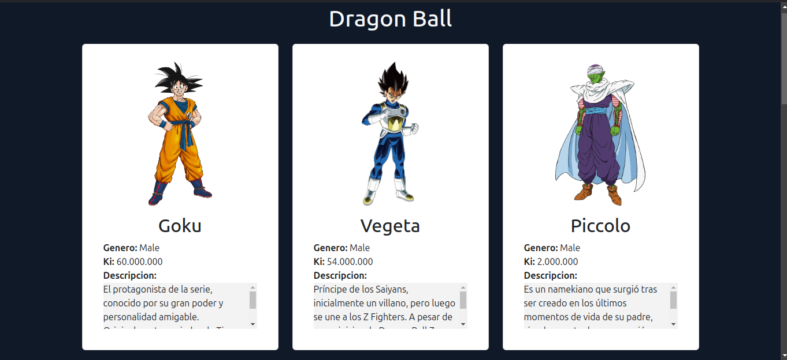

# Descripción del Repositorio
- Este repositorio contiene un pequeño proyecto realizado completamente en React en el cual se consume una API publica de [Dragon Ball](https://web.dragonball-api.com/) (a través de la APi fetch de Javascript) se muestran en tarjetas las imagenes de los personajes mas importantes de esta serie animada con su nombre, genero, ki y descripcion del personaje.
- Para la realizacion de este proyecto se utilizaron las siguientes tecnologias:
  - [Html](https://developer.mozilla.org/es/docs/Web/HTML): Lenguaje de marcado para esrtuctura basica del proyecto en la web.
  - [Css](https://developer.mozilla.org/es/docs/Web/CSS): Lenguaje de estilos para dar presentacion al proyecto web.
  - [Bootstrap](https://getbootstrap.com/): Framework multiplataforma para diseño de sitios y aplicaciones web basado en HTML y CSS.
  - [Javascript](https://developer.mozilla.org/es/docs/Web/javascript): Lenguaje de programación para desarrollo de forntend y Backend.
  - [React](https://es.react.dev/): Biblioteca Javascript diseñada para crear interfaces de usuario con el objetivo de facilitar el desarrollo de aplicaciones en una sola página.

## Imagenes del proyecto

